<h1 align="center">Rasel Hossen</h1>

  Full-Stack Developer with Go backend engineering experience. 
  Based in Chattogram, Bangladesh. Building in public.

  
  &nbsp;
  
  &nbsp;
  
  &nbsp;
  

---

I'm a self-taught developer who started with JavaScript and the React ecosystem, and has since built hands-on experience in **Go**, **backend engineering**, **system design**, and **production operations**.

I work by building. My open-source work lives here on GitHub — real projects, real tests, real architecture decisions documented as I go.

---

## Flagship Project — The Go Engineer

> A repo-first curriculum for mastering Go by building, testing, and operating real software.

This is my primary open-source project — a structured progression from Go fundamentals to production-shaped backend engineering. It's not a tutorial collection; it's a complete system covering:

- Language foundations, packages, I/O, CLI tools
- HTTP servers, REST API design, gRPC, databases
- Concurrency — goroutines, channels, context, sync primitives
- Testing, benchmarking, and profiling
- Architecture patterns, security, observability, and CI/CD
- A production-grade SaaS backend capstone

  

  <a href="https://github.com/swe-labs/the-go-engineer">Repository</a>
  ·
  <a href="https://github.com/swe-labs/the-go-engineer/blob/main/LEARNING-PATH.md">Learning Path</a>
  ·
  <a href="https://github.com/swe-labs/the-go-engineer/blob/main/ARCHITECTURE.md">Architecture</a>
  ·
  <a href="https://github.com/swe-labs/the-go-engineer/blob/main/CONTRIBUTING.md">Contributing</a>

If you're learning Go and want to follow along, give it a ⭐ and watch the repo.

---

## Selected Projects

### Dev Universe

A collaborative Q&A and developer community platform with voting, badges, content filtering, and recommendations.

**Stack:** Next.js · TypeScript · MongoDB · Tailwind CSS · shadcn/ui  
**What's interesting technically:** Server-side filtering with URL state, role-based access, and a badge system driven by user activity metrics.  
→ [devuniverse.com](https://devuniverse.com) · [Repository](https://github.com/rasel9t6/dev-universe)

---

### K2B Express

Production e-commerce platform with a full admin dashboard, product and order management, and Bkash payment integration.

**Stack:** Next.js · TypeScript · MongoDB · Tailwind CSS  
**What's interesting technically:** Custom Bkash payment flow, real-time order tracking, and a multi-role admin system.  
→ [k2bexpress.com](https://k2bexpress.com)

---

### Sphereal.ai

SaaS landing page built for performance — smooth scroll animations, responsive layout, and optimized Core Web Vitals.

**Stack:** Next.js · TypeScript · Tailwind CSS  
→ [sphereal.ai](https://sphereal.ai) · [Repository](https://github.com/rasel9t6/sphereal-ai)

---

### @phazr/custom-cursor · npm

An npm package for custom interactive cursor experiences with SSR support and zero layout shift.

→ [npmjs.com/package/@phazr/custom-cursor](https://www.npmjs.com/package/@phazr/custom-cursor)

---

## Tech Stack

**Languages**

**Frontend**

**Backend & Data**

**Tooling**

---

## Engineering Metrics

  

  
  

---

## Open to

- Freelance or contract work — full-stack web applications or Go backend services
- Open-source collaboration — Go or Next.js projects
- Backend or full-stack engineering roles — Go, Node.js, or TypeScript

If something here is useful to you, consider [buying me a coffee](https://ko-fi.com/rasel9t6) or [sponsoring on GitHub](https://github.com/sponsors/rasel9t6) — it helps me keep building in public.

---

  <a href="https://www.linkedin.com/in/rasel-9t6/">LinkedIn</a> · 
  <a href="https://rasel-hossen.vercel.app/">Portfolio</a> · 
  <a href="https://ko-fi.com/rasel9t6">Ko-fi</a> · 
  <a href="https://github.com/sponsors/rasel9t6">Sponsor</a>

